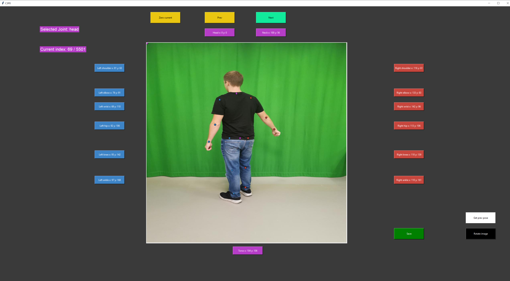

# C3P0-python

## What is C3P0-Python?
C3P0-Python is a keypoint labeling tool for machine learning applications. It is a Python library that provides a high-level interface that is easy to use and intuitive. The package was developed as a part of my master's thesis at Høgskolen i Østfold.

## Installation
To install the package, run the following command:

**Step 1: git clone** 
Run the following command to download the package:
`
git clone https://github.com/wsvea-lochert/C3P0-python.git
`

**Step2: install dependencies**

If you are using a Python virtual environment, you can install the dependencies by running the following command to isolate the package:

`pip install tensorflow opencv-python numpy pillow tensorflow_hub`

## Prepare the data
To use the tool, you first have to locate your images folder and make sure they are 1000x1000 pixels. After you have located you image folder add the path to **`line 18`** in **`MainWindow.py`**.

Next create an empty JSON file and add the path to that file on **`line 24`** in **`MainWindow.py`**.

## Run the tool
You are now ready to run the tool. To run the tool, run the following command:
`python3 main.py`

### Keyboard shortcuts
The following keyboard shortcuts are available:

| Key | Function                        |
|-----|---------------------------------|
| R   | Save current pose               |
| E   | Next image                      |
| Q   | Previous image                  |
| J   | Next joint                      |
| L   | Previous joint                  |
| G   | Get previous pose               |
| 1   | Move entire pose left           |
| 2   | Move entire pose up             |
| 3   | Move entire pose down           |
| 4   | Move entire pose right          |
| F   | Get predicted pose from MoveNet |
| W   | Move current keypoint up        |
| S   | Move current keypoint down      |
| A   | Move current keypoint left      |
| D   | Move current keypoint right     |
| Z   | Set current keypoint to 0, 0    |
| V   | Swich left and right side       |
| T   | Get next pose                   |

## Screenshots

